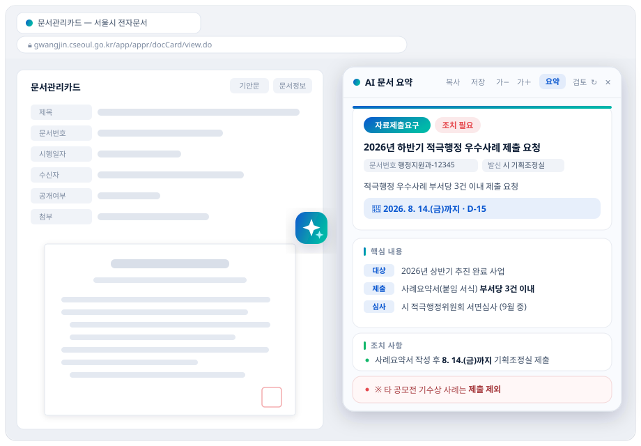
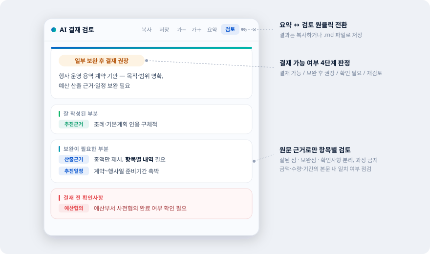
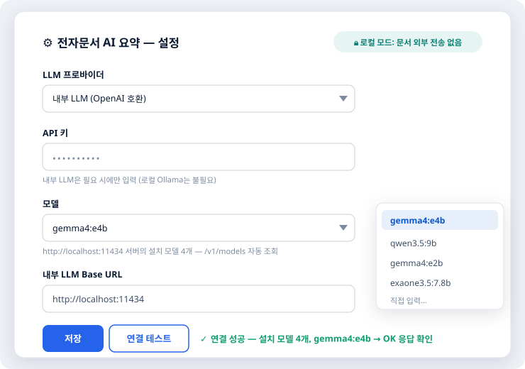
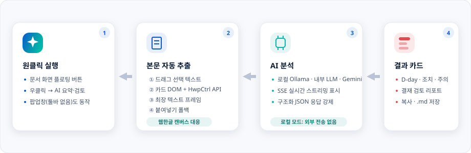

# 전자문서 AI 요약 — Edge 확장

공공기관 전자문서(공문) 열람 화면에서 본문을 추출해 LLM으로 **요약·검토**하는 브라우저 확장입니다.
클릭 한 번이면 **문서 종류 · 조치 필요 여부 · 기한(D-day) · 핵심 내용 · 조치사항 · 주의점**이
위젯 패널로 정리됩니다. 하루 수십 건 공문을 접수하는 담당자가 "이 문서로 내가 뭘 언제까지
해야 하는가"를 10초 안에 파악하는 것이 목표입니다.

- **로컬 동작이 기본** — Ollama 연동 시 문서가 PC 밖으로 나가지 않음 (Gemini API도 선택 가능)
- **SSE 스트리밍** — 응답이 생성되는 대로 카드가 실시간으로 채워짐 (느린 로컬 LLM도 체감 대기 최소화)
- **첨부파일 내용 분석** — 문서카드의 첨부(hwp·hwpx·docx·xlsx·pptx·txt)를 브라우저 안에서
  직접 파싱해 요약·검토에 반영 (서버·업로드 없음, hwp는 CFB 바이너리 직접 해석).
  [kordoc](https://www.npmjs.com/package/kordoc) 헬퍼를 켜두면 변환을 kordoc CLI에 위임해
  품질이 올라간다 (표 구조 보존, **pdf·구형 hwp까지** — 자동 감지, 설정 불요)
- **오탈자 검수** — 검토 모드에서 맞춤법·띄어쓰기·조사 호응 오류를 원문 대조 형태(틀림 → 고침)로 제시.
  kordoc 헬퍼가 있으면 **공문 표기법 lint**(날짜·시간·금액·붙임 — 행정업무운영 편람 룰 기반)가 합류
- 서울시 전자문서(`cseoul.go.kr`) 문서관리카드 + 한컴 **웹한글 기안기** 실측 기반
- UI는 [KRDS(대한민국 정부 디자인시스템)](https://github.com/gracefullight/krds) 컬러 토큰 기반

## 미리보기

> 아래 그림은 실제 UI를 재현한 기능 소개 목업입니다 (문서 내용은 예시).

### 📄 원클릭 AI 요약 — 화면 위 오버레이

문서 화면 위에 바로 뜨는 요약 패널. 문서 종류·조치 필요 뱃지, **D-day 계산**, 라벨링된 핵심 내용,
조치사항 체크리스트, ※ 주의 문구까지 한 화면에 정리됩니다.

<p align="center"></p>

### 🔍 결재 전 AI 검토

같은 패널에서 **검토** 버튼 하나로 전환. 결재 가능 여부를 4단계로 판정하고
잘된 점·보완점·결재 전 확인사항을 원문 근거로만 짚어줍니다.

<p align="center"></p>

### ⚙ LLM 연결은 설정 한 페이지로

설치된 로컬 모델 자동 조회(`/v1/models`), **연결 테스트** 버튼으로 저장 전에 왕복 확인.

<p align="center"></p>

## 동작 방식

<p align="center"></p>

공문 본문은 일반 웹페이지처럼 DOM에 있지 않습니다. 서울시 전자문서의 경우 본문이
한컴 웹한글 뷰어(캔버스 렌더링) 안에 있어서, 4단계 추출 파이프라인으로 접근합니다.

| 순위 | 방법 | 비고 |
|---|---|---|
| 1 | 사용자가 드래그 선택한 텍스트 | 추출이 이상할 때 수동 폴백 |
| 2 | 문서관리카드 DOM(`SITE_RULES`) + **웹한글 `HwpCtrl.GetTextFile` API** | 한컴 공식 API — 캔버스 렌더링이어도 본문 추출 |
| 3 | 전체 프레임 중 최장 텍스트 프레임 | 범용 사이트 폴백 |
| 4 | 붙여넣기 입력창 | 전부 실패 시 |

2단계의 웹한글 API 프로브는 `GetTextFile`(콜백/동기 반환 모두 수용)이 실패하면
`InitScan → GetText` 청크 루프로 폴백하고, executeScript가 못 들어가는 about:blank
프레임은 부모에서 iframe `contentWindow`를 직접 조회해 커버합니다.

카드 메타(`[문서관리카드 정보]`)와 공문 본문(`[공문 본문]`)을 병합해 LLM에 전달하고,
구조화된 JSON(서지정보·핵심내용·조치·주의)으로 받아 렌더링합니다. 응답은 **SSE 스트리밍**으로
받아 미완성 JSON을 부분 파싱해 실시간으로 그리며, 유휴 30초/전체 2분 이중 타임아웃으로
멈춘 스트림을 끝없이 기다리지 않습니다.

## 설치

1. 이 레포를 클론(또는 ZIP 다운로드)
2. Edge에서 `edge://extensions` → **개발자 모드** 켜기 → **압축을 풀어서 로드** → 레포 폴더 선택
   (Chrome도 동일하게 동작합니다)
3. LLM 연결 — 둘 중 하나:

### A. 로컬 LLM (기본값 — 문서가 밖으로 안 나감)

`edge://extensions`에서 이 확장의 **ID**(a~p 32자)를 복사한 뒤:

```powershell
powershell -ExecutionPolicy Bypass -File scripts\setup-local-llm.ps1 -ExtensionId <복사한ID>
```

Ollama 설치 확인(없으면 winget 설치) → **이 확장 ID에만** 접근 허용(`OLLAMA_ORIGINS`) →
모델 다운로드 → 검증까지 자동으로 처리합니다. 끝나면 확장 옵션에서 드롭다운으로 모델만
고르면 됩니다 (Base URL 비워두면 `localhost:11434`).

> Ollama에는 인증이 없고 `OLLAMA_ORIGINS` 허용목록이 유일한 접근 통제입니다. 와일드카드
> (`chrome-extension://*`)로 열면 설치된 **모든** 확장이 로컬 LLM을 쓰거나 모델을 받고 지울 수
> 있으므로, 반드시 확장 ID를 지정하세요.

### B. Gemini API (빠름 — 단, 본문이 Google로 전송됨)

확장 아이콘 우클릭 → 확장 옵션 → [aistudio.google.com/apikey](https://aistudio.google.com/apikey)에서
발급한 키 입력.

> ⚠️ **공공기관 문서에는 권장하지 않습니다.** 이 모드는 요약 대상 문서의 **본문 전체를
> Google 서버(국외)로 전송**합니다.
> - 개인정보가 포함된 공문서·민원 문서를 외부 AI 서비스로 보내면 개인정보 국외 이전에
>   해당할 수 있습니다. 소속 기관의 정보보안·개인정보 처리 지침을 먼저 확인하세요.
> - 무료 등급 API는 제출한 내용이 서비스 개선에 이용될 수 있어, 비공개·민감 정보 제출이
>   약관상 제한됩니다.
> - 기관 업무에는 **A. 내부 LLM(Ollama)** 방식을 쓰면 문서가 PC·내부망 밖으로 나가지
>   않습니다.

### C. kordoc 헬퍼 (선택 — 첨부 변환 품질↑ + 공문 표기법 검수)

[kordoc](https://www.npmjs.com/package/kordoc)(한국 문서 파서 CLI)이 있으면 첨부 변환을 위임하고
검토 모드에 표기법 lint를 얹을 수 있습니다. Node.js 설치 후:

```powershell
powershell -ExecutionPolicy Bypass -File scripts\setup-kordoc-helper.ps1
```

kordoc 설치 확인(없으면 `npm i -g kordoc`) → 로그인 시 자동 시작 등록 → 기동·검증까지 처리합니다.
헬퍼는 `127.0.0.1:8531`에만 바인딩되고 CORS를 열지 않아 이 확장만 호출할 수 있으며, 파일은
임시폴더에서 변환 후 즉시 삭제됩니다. 확장이 자동 감지하므로 옵션 설정은 없습니다.

## 사용

- 전자문서 화면 우측의 **✨ 플로팅 버튼** 클릭 (드래그로 위치 이동, 위치 기억됨)
- 또는 아무 데나 **우클릭 → "📄 이 문서 AI 요약" / "🔍 이 문서 AI 검토 (결재 전)"**
  — 전자문서가 툴바 없는 팝업창으로 열려도 동작
- 패널 헤더의 **요약 ↔ 검토** 버튼으로 모드 전환 — 한 번 분석한 결과는 탭별로 캐시되어
  전환 시 즉시 표시, **↻** 버튼으로 캐시 무시하고 새로 분석
- 스트리밍 중에는 새로 생성되는 텍스트가 타이핑되듯 자연스럽게 표시됩니다 (커서·페이드인)
- 패널: **복사**(마크다운) · **저장**(.md 파일) · 글자 크기 조절 · 헤더 드래그 이동
- **검토 모드**: 결재 가능 여부 4단계 판정 + 잘된 점 / 보완점 / 결재 전 확인사항 + **오탈자·표기**
  (원문 취소선 → 수정안, 이유 태그) — 원문에 있는 내용만 근거로 검토하며, 근거 없는 지적·칭찬을
  만들지 않도록 프롬프트로 강제. 오탈자만으로는 판정을 낮추지 않음
- **첨부파일**: 문서카드 화면이면 첨부 내용을 함께 분석 — 패널에 `📎 첨부 N건 내용 분석 포함`으로
  표시. 내용을 못 읽은 파일은 파일명만 반영하고 사유를 표시
  - 서울시 전자문서는 첨부 **직접 다운로드가 막혀 있어**(링크가 JS 전용이고 응답은 안내 페이지),
    뷰어의 **간편 미리보기** 경로로만 원본을 읽을 수 있습니다. 미리보기를 열면 뷰어가 서버에
    스테이징된 원본(`/WORK_TEMP/…`)을 변환 서버에 열게 하고, 확장은 그 경로를 잡아 텍스트를 회수합니다
  - 옵션의 **첨부파일 자동 분석**(기본 꺼짐)을 켜면 확장이 우클릭 → 미리보기를 대신 수행합니다.
    합성 클릭은 페이지가 무시하므로(`isTrusted` 검사) 실제 입력 주입이 필요해 `debugger` API를 씁니다 —
    동작 중 "디버깅하고 있습니다" 알림 막대가 잠시 표시됩니다. 이 옵션을 켜지 않으면 디버거는
    전혀 사용되지 않으며, 첨부는 파일명만 반영됩니다

## 문제 해결

**연결 테스트에서 "API 키가 올바르지 않습니다"가 뜨는데 키 칸은 비어 있다**

내부 LLM(Ollama)은 키를 쓰지 않으므로 키 문제가 아닙니다. Ollama가 확장의 오리진
(`chrome-extension://…`)을 허용목록에 넣지 않아 **403**으로 끊은 것입니다 — Ollama의 기본
허용목록에는 브라우저 확장이 들어 있지 않습니다.

```powershell
# 확장 ID 확인: edge://extensions → 이 확장의 ID(a~p 32자)
powershell -ExecutionPolicy Bypass -File scripts\setup-local-llm.ps1 -ExtensionId <복사한ID>
```

이미 돌렸는데도 같은 증상이면 **환경변수가 지금 도는 Ollama 프로세스에 반영되지 않은 것**입니다.
트레이의 Ollama 아이콘 → **Quit**(창만 닫으면 서버는 계속 돕니다) 후 스크립트를 다시 실행하세요.
확인은 PowerShell에서:

```powershell
[Environment]::GetEnvironmentVariable("OLLAMA_ORIGINS","User")   # 확장 ID가 들어 있는지
Invoke-WebRequest http://localhost:11434/v1/models -Headers @{Origin="chrome-extension://<확장ID>"} -UseBasicParsing
```

두 번째 명령이 200이면 정상, 403이면 아직 반영 전입니다. 확장을 **다른 폴더에서 다시 로드하면
ID가 바뀌므로** 그때는 새 ID로 다시 실행해야 합니다.

## 로컬 모델 선택 가이드 (실측)

RX 9060 8GB VRAM, 동일 공문 요약 기준 웜(모델 로드 후) 속도. 첫 호출은 로드로 +15초쯤.

| 모델 | 크기 | 속도 | 품질 | 비고 |
|---|---|---|---|---|
| `gemma4:e4b` (기본) | 9.6GB | 30.4초 | **형식 완전 준수, 가장 안정** | 8GB VRAM엔 부분 CPU 오프로드라 느림 |
| `qwen3.5:9b` | 6.6GB | **13.1초** | 준수하나 거침 — 숫자 띄어쓰기·볼드 짝 오류, 발신처 창작 1회 관측 | 8GB VRAM에 완전 탑재 → 최속. 씽킹 모델(확장이 자동으로 사고 비활성화) |
| `gemma4:e2b` | 7.2GB | 18.5초 | 라벨·볼드 형식 일부 미준수 | 균형형 |
| `exaone3.5:7.8b` | 4.8GB | — | 한국어 특화(LG) | ⚠ 라이선스가 연구용 — 기관 업무 사용 전 확인 필요 |

정확성이 중요하면 `gemma4:e4b`, 속도가 중요하면 `qwen3.5:9b`를 권합니다.

VRAM이 넉넉한 환경(16GB+)이라면 `gemma4:26b`·`qwen3.5:27b`급이 품질을 크게 끌어올립니다.
설치된 모델은 확장 옵션의 드롭다운에 자동으로 나타납니다 (`/v1/models` 조회).

## 다른 전자문서 시스템에 이식하기

0. 확장 옵션의 **"플로팅 버튼 표시 주소"**에 기관 그룹웨어 호스트를 추가하고, 저장할 때 뜨는
   **권한 요청을 허용**하면 코드 수정 없이 ✨ 버튼이 표시됩니다 (우클릭 메뉴·툴바 팝업은 원래
   어디서나 동작). 웹한글 기안기 기반 시스템이면 이것만으로 본문 추출까지 될 가능성이 높습니다.
1. 전자문서 열람 화면에서 F12 → Console에 [`dump-dom.js`](dump-dom.js) 내용을 붙여넣어 실행
2. 클립보드에 복사된 DOM 구조 JSON을 확인
3. [`extractor.js`](extractor.js)의 `SITE_RULES`에 본문 셀렉터 추가
   (예: `{ host: /example\.go\.kr$/, selectors: [{ sel: '#docBody', exclude: [] }] }`)

웹한글 기안기를 쓰는 시스템이면 `HwpCtrl.GetTextFile` 프로브가 그대로 동작할 가능성이 높습니다.
시스템별 래퍼 객체(예: `HwpManager`)에는 호출하지 않도록 되어 있습니다 — 임의 호출 시
사용자 화면에 에러 모달이 뜰 수 있습니다.

## 파일 구조

| 파일 | 역할 |
|---|---|
| `manifest.json` | MV3 매니페스트 (전 사이트 권한 없음 — 선택적 호스트 권한, debugger는 옵션을 켤 때만 사용) |
| `recorder.js` | 뷰어가 문서를 여는 경로(openurl) 기록 — 첨부 미리보기 경로 학습용 |
| `background.js` | 요약·검토 오케스트레이션: 트리거, 요청 취소·캐시, 웹한글 API 프로브(폴백 체인), 위젯 스크립트 동적 등록, MV3 워커 keepalive |
| `overlay.js` | 페이지 주입 결과 패널 렌더러 (closed Shadow DOM, 스트리밍 타이핑 연출) |
| `widget.js` | 문서 화면 플로팅 ✨ 버튼 (승인 호스트에만 동적 등록) |
| `extractor.js` | 페이지 주입 추출기 (사이트 룰 + 범용 폴백) |
| `attachments.js` | 페이지 주입 첨부 분석기 — 링크 발견·다운로드 + hwp(CFB)/hwpx·docx·xlsx·pptx(ZIP)/txt 텍스트 추출 |
| `pick.js` | 프레임별 추출 결과 선정·병합 + 동일 출처 필터 + 길이 상한 |
| `llm.js` | Gemini / OpenAI 호환 프로바이더 추상화 + SSE 스트리밍·부분 JSON 파서 + 타임아웃·취소 + 연결 테스트 |
| `prompts.js` | 요약·검토 시스템 프롬프트 + 신뢰 경계(구분자·판정 화이트리스트) |
| `config.js` | 설정 로드·저장 단일 진입점 (키 분리 보관, 주소 검증, 호스트 패턴) |
| `md.js` | 복사·내보내기용 마크다운 생성 |
| `popup.html/js` | 툴바 아이콘용 요약 UI (스트리밍 렌더) |
| `options.html/js` | 프로바이더·모델(드롭다운 자동 조회)·API 키 설정 + 연결 테스트 |
| `docs/*.svg` | README 기능 소개 목업 이미지 |
| `dump-dom.js` | 전자문서 DOM 구조 덤프용 콘솔 스니펫 |
| `scripts/setup-local-llm.ps1` | 로컬 LLM(Ollama) 자동 설정 — 오리진 허용 + 컨텍스트 길이 |
| `scripts/kordoc-helper.mjs` | kordoc 로컬 헬퍼 서버 — POST /extract(첨부→마크다운), /lint(표기법 검수) |
| `scripts/setup-kordoc-helper.ps1` | kordoc 헬퍼 설치·자동 시작 등록 |
| `BACKEND.md` | 확장 계획: 내부 LLM 서버 + 첨부파일(hwp/xlsx) 분석 아키텍처 |

## 보안·프라이버시

**본문이 나가는 경로**
- 기본 프로바이더는 **내부 LLM(로컬)** 입니다. 이 모드에서 문서는 지정한 서버 밖으로 나가지 않습니다.
- Gemini로 바꾸면 본문 전체가 Google 서버(국외)로 전송됩니다. 요약·검토 패널 헤더에 어느 쪽으로
  나갔는지(`Gemini · 외부 전송` / `로컬`) 항상 표시됩니다.
- 원격 내부 서버를 `http://`로 지정하면 저장 시 경고하고 확인을 받습니다 — 평문이면 본문과 키가
  그대로 네트워크에 흐릅니다.

**권한**
- 매니페스트는 전 사이트 권한(`<all_urls>`)을 요구하지 않습니다. 우클릭 메뉴·툴바 아이콘은
  `activeTab`(사용자가 실행한 그 탭, 그 순간만)으로 동작합니다.
- ✨ 플로팅 버튼은 옵션에 입력한 호스트에 대해 저장 시 권한을 요청하고, 승인한 곳에만
  콘텐츠 스크립트를 동적 등록합니다. 호스트 매칭은 정확한 도메인과 하위 도메인만 인정합니다.

**추출 범위**
- 최상위 문서와 **같은 출처인 프레임만** 읽습니다. 페이지가 임베드한 타 사이트 iframe의 내용은
  분석에서 제외되며, 제외된 프레임 수를 패널에 표시합니다.
- 첨부파일 분석은 **문서관리카드 화면(사이트 룰 매칭)에서만** 동작하고, 문서와 **같은 출처의
  다운로드 링크만** 세션 쿠키로 받습니다. 파일은 브라우저 안에서만 파싱되며 어디에도 업로드되지
  않습니다 (추출된 텍스트만 선택한 LLM으로 감).
- 결과 패널은 `closed` Shadow DOM이라 페이지 스크립트가 요약 내용을 읽거나 패널 버튼을
  대신 누를 수 없습니다.

**키·데이터 보관**
- API 키는 `chrome.storage.local`에 저장되어 **이 기기 밖으로 나가지 않습니다**(계정 동기화 대상 아님).
  Gemini 키와 내부 LLM 키는 별도 슬롯이라 프로바이더를 바꿔도 서로에게 전송되지 않습니다.
- 확장은 문서를 어디에도 저장하지 않습니다. 요약 결과는 탭이 닫히면 사라지는 세션 캐시에만
  잠시 머물고, 사용자가 복사·저장할 때만 파일로 남습니다.

**남아 있는 한계**
- 검토 모드는 문서 본문을 LLM에 넣으므로, 본문에 심어둔 문구가 판정을 흔들려 시도할 수 있습니다.
  구분자 격리와 판정 화이트리스트로 막고 있으나 완전하지 않습니다 — **결재 판단의 근거로 쓰지 마세요.**
- 30,000자를 넘는 문서는 앞부분만 분석하며, 잘렸다는 사실을 패널에 표시합니다.

## 참고한 것들

- **KYCI Assistant** (한국청소년상담복지개발원 행정보조 확장, © KYCI) — 같은 문제(한컴 웹한글
  텍스트 추출 + LLM 연동)를 먼저 푼 프로덕션 확장. 코드를 가져오지 않고 다음 구현 패턴을
  참고해 재구현했습니다: `InitScan → GetText` 청크 추출 폴백, 웹한글 iframe 탐색 셀렉터,
  SSE 스트리밍의 유휴/전체 이중 타임아웃과 부분 JSON 파싱, 결재 검토 4단계 판정 구조
- **한컴 웹한글 기안기 API** — `HwpCtrl.GetTextFile` 등 공식 컨트롤 API (본문 추출의 핵심)
- [KRDS — 대한민국 정부 디자인시스템](https://github.com/gracefullight/krds) — UI 컬러 토큰
- [Ollama](https://ollama.com) / [Google Gemini API](https://ai.google.dev) — LLM 백엔드

## 라이선스

[MIT](LICENSE)
